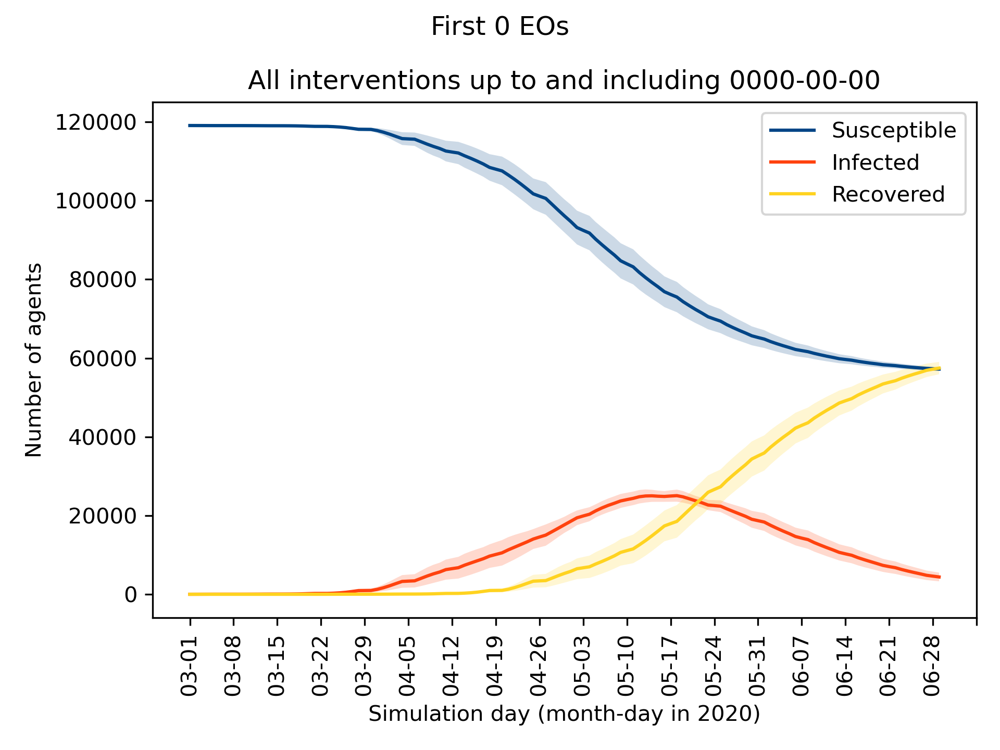
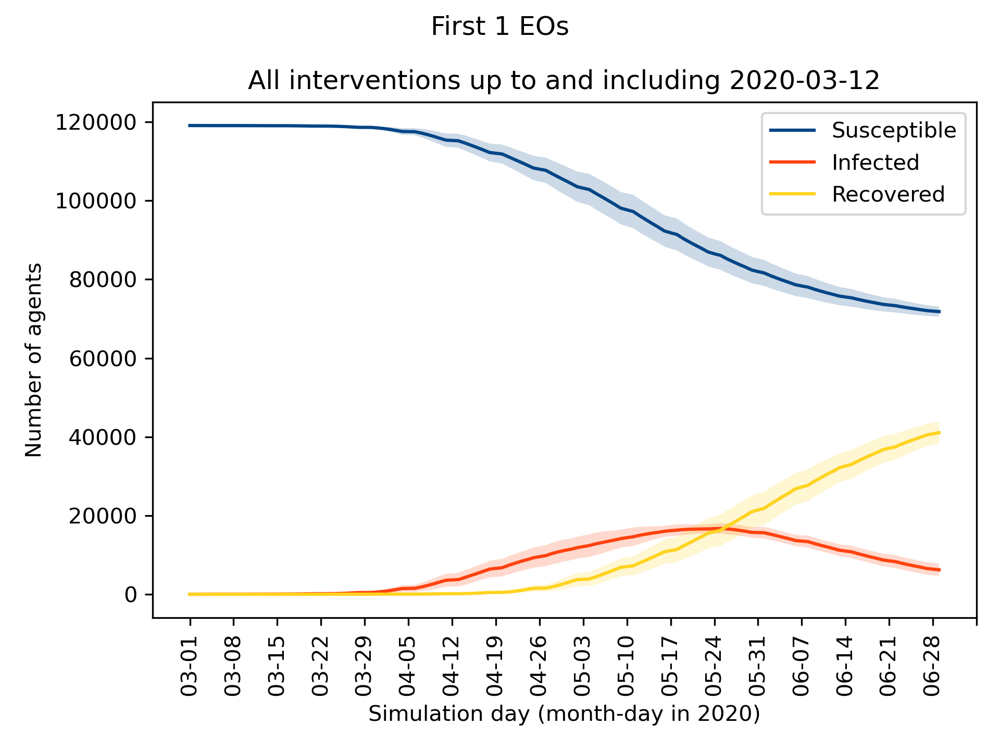
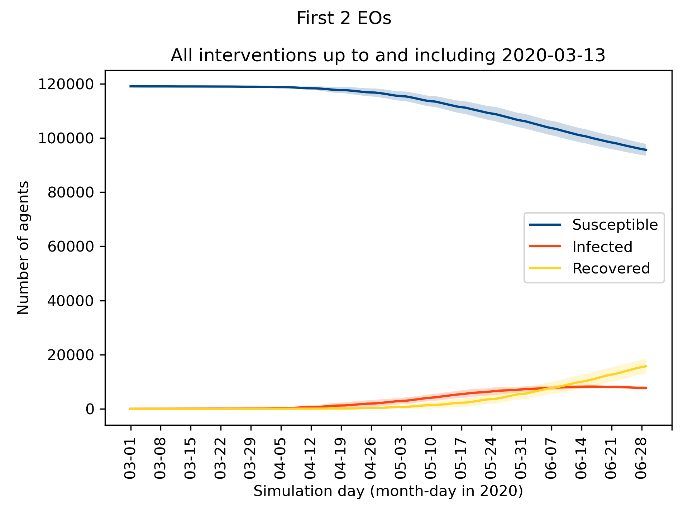
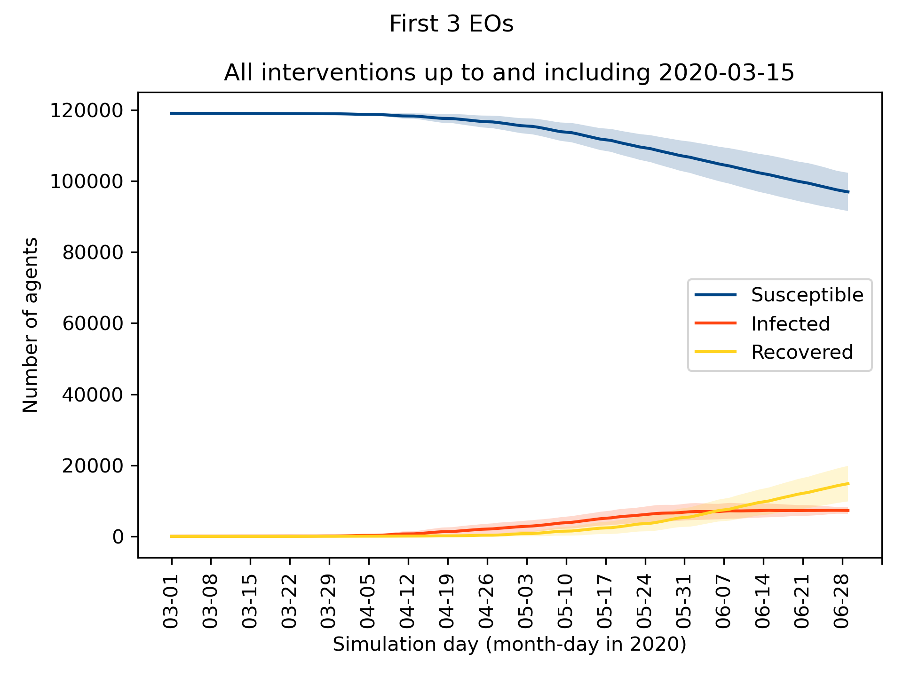
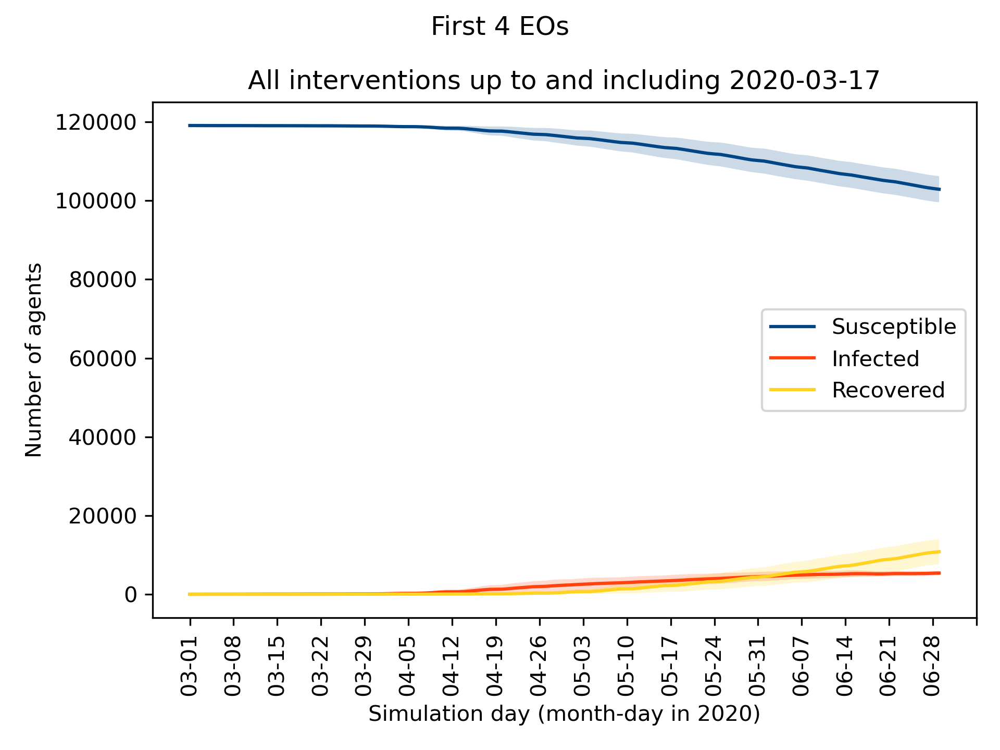
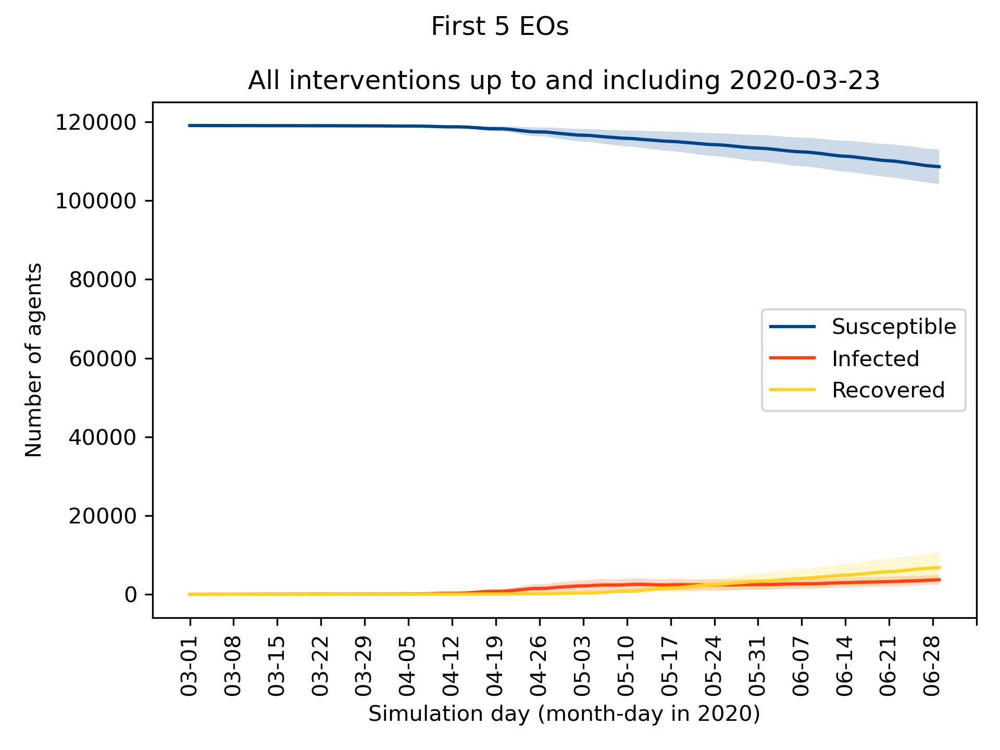
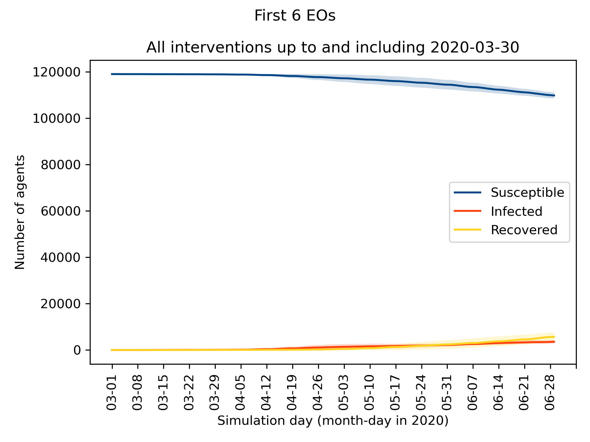
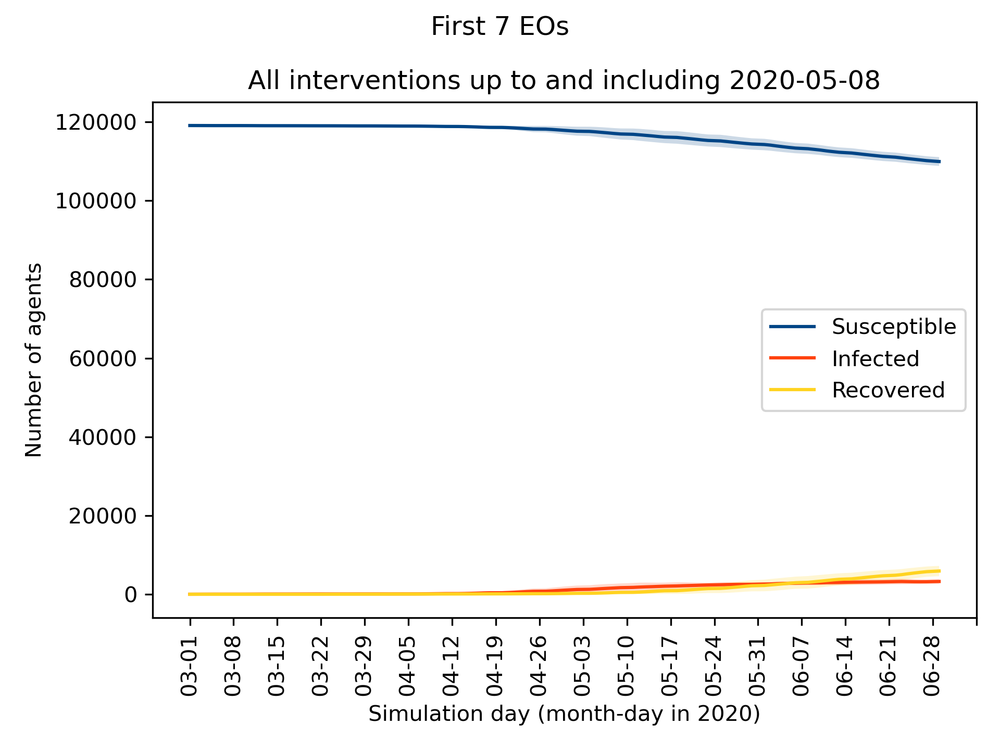
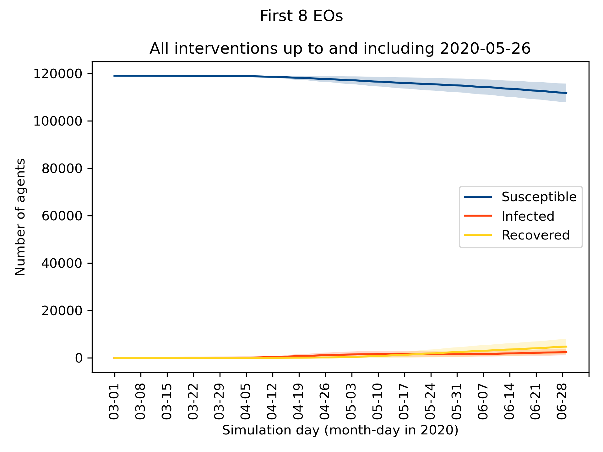
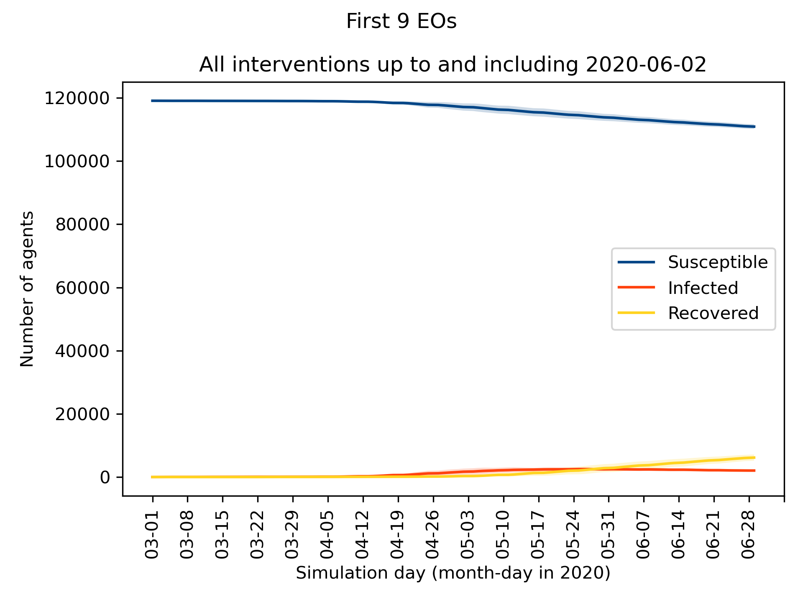

A large-scale data-driven agent-based simulation model where individual agents reason about their beliefs, objectives, trust in government, 
and the norms imposed by the government to model the public's response to behavioral interventions to mitigate the spread of novel diseases. 
The agents' internal and external attitudes are based on actual data concerning daily activities of individuals, their political orientation, 
and norms being enforced in the US state of Virginia.

# Experiment
The agents' behavior and the disease propagation probabilities were calibrated independently, by minimizing the Root Mean Square Error (RMSE)
between simulation outcome and results observed in the real world in the period between March 1 and June 28 2020 using Nelder-Mead minimization.

After calibration, an experiment was conducted to understand the relative impact of the 9 executive orders (EOs)
issued in that period on the spread of COVID-19 through 10 counterfactual runs E<sub>0</sub> ... E<sub>9</sub>. 
In each experiment E<sub>_i_</sub>, only the first _i_ EOs were activated in the corresponding simulation. For example,
in E<sub>0</sub>, no behavioral interventions took place, in E<sub>1</sub>, only the first intervention (Encouraging
telework and allow residents of Virginia to wear facial masks) were activated (See [the norm schedule](src/main/resources) for details).

These are the Susceptible-Infected-Recovered (SIR) plots for these experiments, showing the size of the outbreak in each experiment.

| | |
|---|---|
|{width=300 height=225}|{width=300 height=225}|
|{width=300 height=225}|{width=300 height=225}|
|{width=300 height=225}|{width=300 height=225}|
|{width=300 height=225}|{width=300 height=225}|
|{width=300 height=225}|{width=300 height=225}|

# Invoking program
See manual.txt for command line arguments, or call --help when running the application
Note the flag `-c` (or `--connect-pansim`) should be used to share data with the [PanSim](https://github.com/parantapa/pansim) simulation environment.

In the [resource](src/main/resources) directory, an example configuration file is given. Any parameter (or county) can be uncommented to ignore it. For repeatable simulations, make sure to specify the global seed, and a seed for each county (uncommented in the example configuration)

The JAR file is automatically generated and placed in the `target` directory. In order to use the JAR file, make sure to use the Java version used by Maven, and call

```bashs
$ java -jar sim2apl-episimpledemic-simulation-1.0-SNAPSHOT-jar-with-dependencies.jar [args]
```

# Prerequisites
This manual assumes Maven is installed for easy package management

Prerequisites:
* Java 14+ (not tested with lower versions)
* Sim2APL
* (Maven)

## Sim2APL
Download Sim2APL from Bitbucket, and checkout the `feature/generic-plan-return` branch.

```bash
$ git clone https://bitbucket.org/goldenagents/sim2apl.git
$ cd sim2apl
$ git checkout origin/feature/generic-plan-return -b feature/generic-plan-return
```

Install the package using Maven:

```bash
$ mvn -U clean install
```

This will automatically add the library to your local Maven repository, so no further action is required here.

## This library
Clone the master branch of this library and install with Maven, or open in an IDE with Maven support (e.g. VSCode, Idea Intellij, Eclipse or NetBeans) and let the IDE set up the project.

```bash
$ git clone https://bitbucket.org/goldenagents/sim2apl-episimpledemics.git
$ cd sim2apl-episimpledemics
$ mvn -U clean install
```

The application requires various arguments, either when invoked from the command line or when used in an IDE.
See [manual.txt](manual.txt) for more information, or invoke the program with the argument `--help`

An example of a configuration file (using the [TOML](https://github.com/toml-lang/toml) language) is given in [config.toml](src/main/resources/config.toml) 

